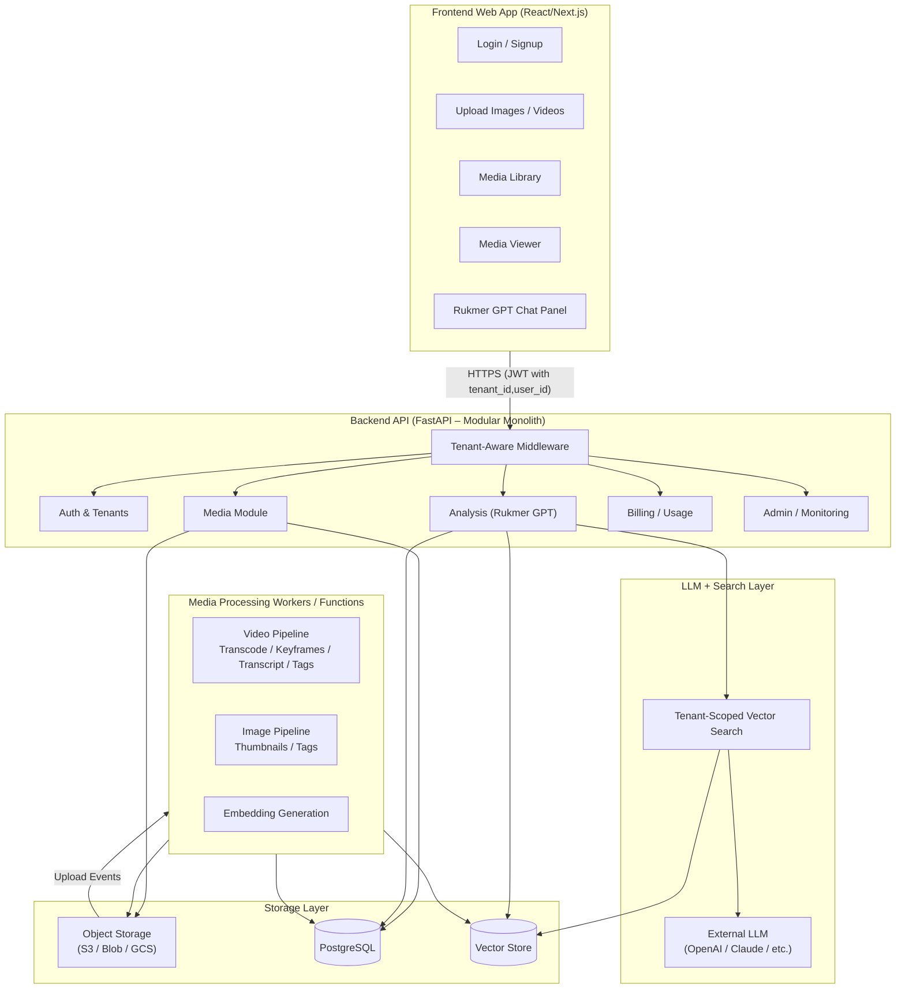
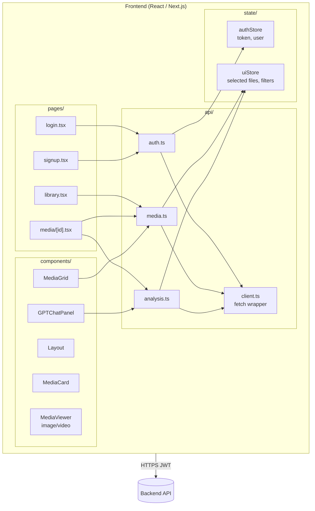
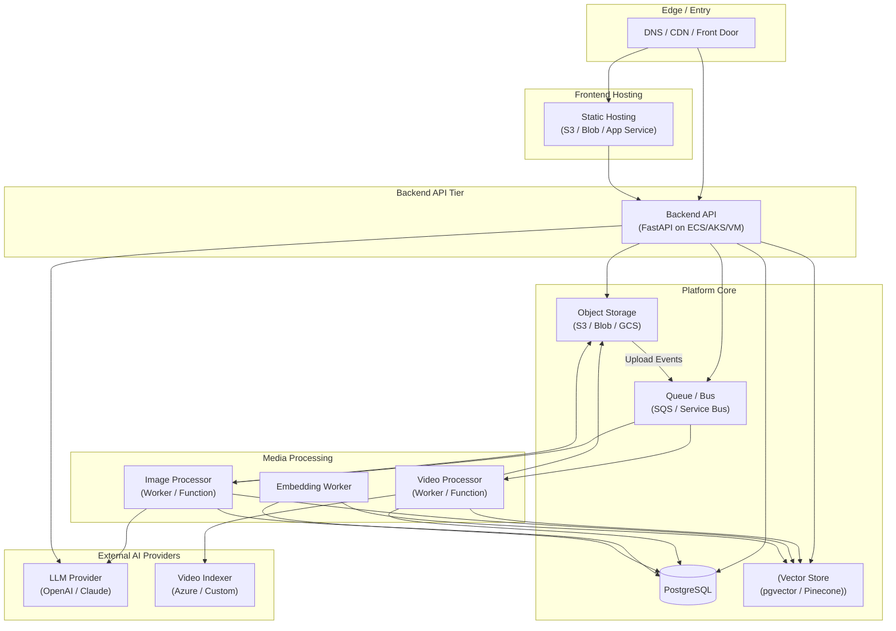
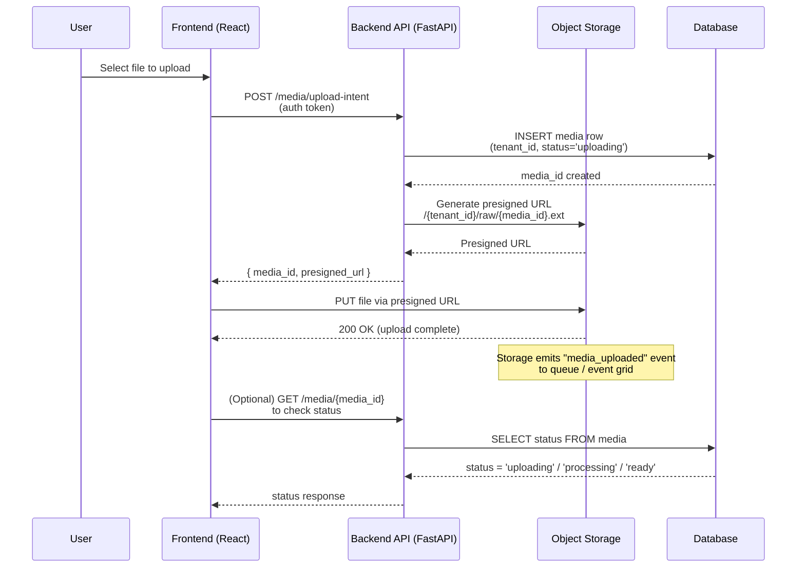
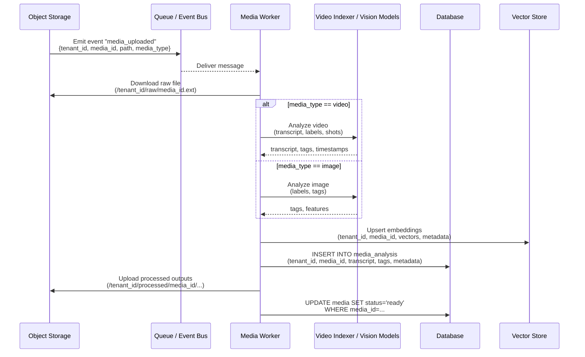
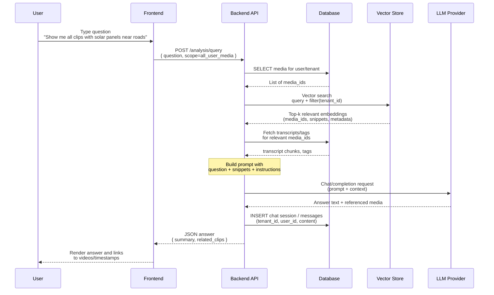

# ConstructServ – System Architecture

This document describes the full architecture of the RukmerGPT platform, including:
- High-level system design  
- Backend architecture  
- Frontend architecture  
- Storage & processing pipeline  
- LLM analysis flow  
- Mermaid diagrams for clarity  

---

# 1. High-Level System Architecture

---

# 2. Backend Architecture (Modular Monolith)

```mermaid
flowchart TD
    subgraph API["API Layer (FastAPI)"]
      AuthAPI[auth_api.py]
      MediaAPI[media_api.py]
      AnalysisAPI[analysis_api.py]
      BillingAPI[billing_api.py]
      AdminAPI[admin_api.py]
    end

    subgraph Services[Application Services]
      AuthSvc[AuthService]
      TenantSvc[TenantService]
      MediaSvc[MediaService]
      AnalysisSvc["AnalysisService<br>(Rukmer GPT)"]
      BillingSvc[BillingService]
    end

    subgraph Domain[Domain Layer]
      User[User]
      Tenant[Tenant]
      MediaAsset[MediaAsset]
      AnalysisReq[AnalysisRequest]
      AnalysisRes[AnalysisResult]
      UsageRec[UsageRecord]
    end

    subgraph Infra[Infrastructure Layer]
      subgraph DB[DB / Persistence]
        ORM[SQLAlchemy ORM Models]
        UserRepo[UserRepository]
        TenantRepo[TenantRepository]
        MediaRepo[MediaRepository]
        AnalysisRepo[AnalysisRepository]
        UsageRepo[UsageRepository]
      end

      subgraph Storage[Storage]
        BlobClient["BlobClient<br>(S3 / Blob)"]
      end

      subgraph Events[Events]
        EventPub["EventPublisher<br>(queues / bus)"]
      end

      subgraph AI[AI & Search]
        AIClient["AIClient<br>(LLM abstraction)"]
        VecClient[VectorStoreClient]
      end
    end

    subgraph Workers[Workers / Functions]
      VidWorker[VideoProcessorWorker]
      ImgWorker[ImageProcessorWorker]
      EmbWorker[EmbeddingWorker]
    end

    AuthAPI --> AuthSvc
    MediaAPI --> MediaSvc
    AnalysisAPI --> AnalysisSvc
    BillingAPI --> BillingSvc
    AdminAPI --> AuthSvc

    AuthSvc --> User
    TenantSvc --> Tenant
    MediaSvc --> MediaAsset
    AnalysisSvc --> AnalysisReq
    AnalysisSvc --> AnalysisRes
    BillingSvc --> UsageRec

    AuthSvc --> UserRepo
    TenantSvc --> TenantRepo
    MediaSvc --> MediaRepo
    AnalysisSvc --> AnalysisRepo
    BillingSvc --> UsageRepo

    MediaSvc --> BlobClient
    AnalysisSvc --> VecClient
    AnalysisSvc --> AIClient
    AnalysisSvc --> EventPub

    VidWorker --> BlobClient
    VidWorker --> AnalysisRepo
    VidWorker --> VecClient

    ImgWorker --> BlobClient
    ImgWorker --> AnalysisRepo
    ImgWorker --> VecClient

    EmbWorker --> VecClient
    EmbWorker --> AnalysisRepo
```

---

# 3. Frontend Architecture (React / Next.js)

---

# 4. Cloud / Infrastructure Architecture

---

# 5. Sequence Diagram – Upload Flow

---

# 6. Sequence Diagram – Media Processing Pipeline

---

# 7. Sequence Diagram – GPT Query Flow

---
